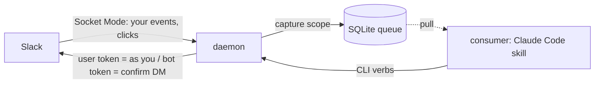
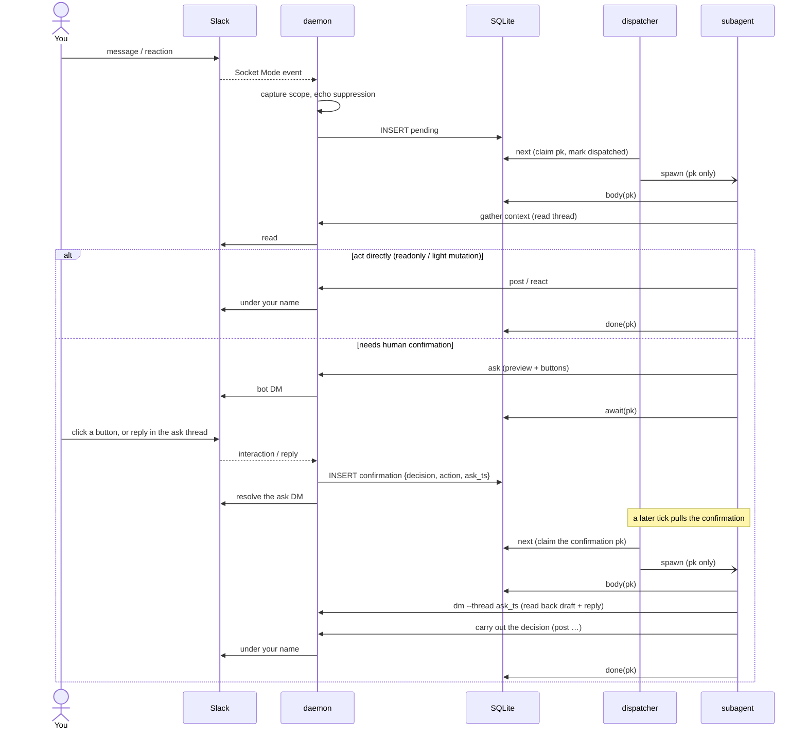

# slack-deputy

Act as yourself on Slack. A small Rust daemon is the only thing that touches
Slack; a resident Claude Code session does the thinking.

## Overview

slack-deputy lets an agent handle your Slack **as you** — under your own identity,
not a bot. The daemon receives your own messages and reactions over Socket Mode,
captures the ones worth acting on into a local queue, and exposes a localhost API
to post and react under your own name (a Slack user token). A resident Claude Code
session drains that queue and handles each event with a stateless subagent.

What you get:

- **Receive** your own messages and reactions (self-perspective events).
- **Act as yourself** — post, react, and reply under your own name.
- **Reaction-as-command** — a reaction you place becomes a trigger; you map
  reactions to actions yourself (`reactions.tsv`).
- **Human-in-the-loop** — before anything risky the agent asks you in a bot DM:
  approve / reject, pick an option, or reply with a free-text edit.

The daemon is dumb plumbing — it owns Slack I/O and a SQLite queue and makes no
decisions. All judgment lives in the consumer.

> Driving a human account with a user token is a grey area under Slack's ToS. Run
> it on your own account, modestly.

## Architecture



- **daemon** — the only Slack edge. Holds all tokens and the Socket Mode
  connection. Triages inbound events (capture scope, echo suppression), stores
  them in SQLite, and serves a localhost HTTP API for outbound
  (`post` / `react` / `ask` / …). Events aimed at you (DM, mention, …) are stored
  as `pending` and dispatched; ambient context (a watched channel, your own
  posts) is stored but never dispatched, so the consumer pays nothing for it
  until a handler pulls it in as context.
- **SQLite** — the queue and the single source of inbound truth. One `messages`
  table; status flows `pending → dispatched → done` (or `awaiting_human` when a
  handler hands off to a confirmation). `ambient` rows are captured for context
  only and never enter that flow. `skip` retires pending rows as `skipped`
  without processing them — use `slack-deputy skip --all` on consumer recovery to
  drop the backlog queued during downtime instead of replaying it.
- **consumer** — a Claude Code skill. A long-lived *dispatcher* drains the queue
  (it only claims PKs, never reads message bodies — untrusted Slack text stays out
  of its context) and hands each event to a background *subagent* that reads the
  body, decides, and acts through the CLI.
- **confirmation** — when a subagent needs a human it `ask`s in a bot DM. Your
  click or thread reply returns as another queue event, so Slack itself holds the
  pending state and the server stays stateless.

One binary is both the daemon (run with no subcommand) and the CLI the consumer
drives (`next` / `body` / `post` / `react` / `ask` / …). Every verb goes through
the daemon's HTTP API — the daemon is the sole owner of SQLite and the Slack
tokens — so the consumer holds no database and no credentials. Point
`SLACK_DEPUTY_URL` at the daemon to drive it from another host (see
[Running across hosts](#running-across-hosts)).

### Event flow



The confirmation answer is one path whether you click or reply: both land as a
single `confirmation` event. The row carries only the decision, the opaque action,
and a pointer to the ask — the handler reads the content (draft, your reply) back
from the ask thread, so the server keeps no per-confirmation state.

## Install

Requires [Homebrew] and a Slack workspace where you can install an app.

1. **Install the binary**

   ```sh
   brew install m5d215/tap/slack-deputy
   ```

2. **Create the Slack app** from [`manifest.yml`](manifest.yml):
   <https://api.slack.com/apps> → **Create New App** → **From a manifest** → paste
   the file.

   - **Basic Information → App-Level Tokens**: create one with `connections:write`
     → the app token (`xapp-`).
   - **Install to Workspace** (may need workspace-admin approval), then collect the
     **Bot** token (`xoxb-`) and the **User** token (`xoxp-`).

3. **Configure** — put the tokens in `~/.config/slack-deputy/.env` (the daemon
   reads this file on start):

   ```sh
   mkdir -p ~/.config/slack-deputy
   cp "$(brew --prefix)/share/slack-deputy/.env.example" ~/.config/slack-deputy/.env
   $EDITOR ~/.config/slack-deputy/.env   # fill in the three tokens
   ```

   Optional: `SLACK_DEPUTY_WATCH_CHANNELS` — comma-separated channel IDs to capture
   even without a mention.

4. **Run the daemon**

   ```sh
   brew services start slack-deputy
   ```

   It opens its queue at `~/.config/slack-deputy/slack-deputy.db` and listens on
   `127.0.0.1:8799`.

5. **Start the consumer** — make the skills under [`.claude/skills`](.claude/skills)
   available to a resident Claude Code session (clone this repo as a working
   directory, or symlink the skills into your skills dir), then invoke the
   **`slack-deputy`** skill. It schedules itself to drain the queue on a timer and
   handle your events. Map reactions to actions in `reactions.tsv` (copy
   `reactions.tsv.example`).

## Running across hosts

The daemon is the sole owner of SQLite and the Slack tokens; the CLI is a thin
HTTP client. So the consumer (the Claude Code session) can run on a different
machine from the daemon:

- **On the daemon host**, bind to the network instead of loopback:
  `SLACK_DEPUTY_LISTEN=0.0.0.0:8799` (in `~/.config/slack-deputy/.env`).
- **On the consumer host**, install the binary and point it at the daemon:
  `SLACK_DEPUTY_URL=http://<daemon-host>:8799`. No DB file, no tokens needed there.

The HTTP API has **no authentication** — put both hosts on a [Tailscale] tailnet
(or equivalent) and let its ACLs be the boundary. Do **not** expose the port to an
untrusted network: anyone who can reach it can post as you and drain your queue.

## License

MIT

[Homebrew]: https://brew.sh
[Tailscale]: https://tailscale.com
